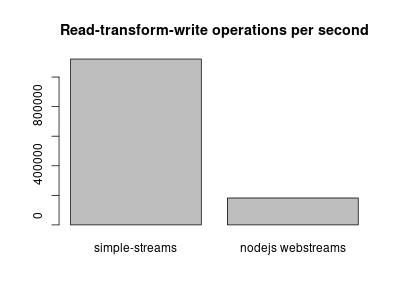

# simple-streams

Alternative to [web streams](https://developer.mozilla.org/en-US/docs/Web/API/Streams_API).
Is faster than nodejs built-in web-streams implementation (see below - pass-through scenario about 6x faster)
The API is similar, but not same.

Implementation uses
[Limited blocking queue](https://www.npmjs.com/package/@jakubneubauer/limited-blocking-queue)
as a buffer for reading/writing
and synchronization mechanism between readers/transformers/writers.

## Example

```javascript
import * as ss from "@jakubneubauer/simple-streams"
let reader = new ss.Reader({
    counter: 0,
    async start(controller) {
        await controller.enqueue("hello");
    },
    async pull(controller) {
        if(this.counter++ === 10) {
            await controller.close();
            return
        }
        await controller.enqueue(this.counter);
    }
});

let trans = new ss.Transformer({
    async transform(chunk, controller) {
        await controller.enqueue("(" + chunk + ")");
    }
});

let writer = new ss.Writer({
    async write(chunk) {
        console.log(chunk);
    }
});

(async function() {
    // We can read with async for loop. The loop is interrupted
    // just for an example so that we can continue reading below.
    for await (let i of reader) {
        console.log(i);
        if (i === 3) break;
    }
    
    // We can continue reading, for example using pipe API.
    await reader
        .pipeThrough(trans)
        .pipeTo(writer)
})();
```

Will output:
```text
hello
0
1
2
3
(4)
(5)
(6)
(7)
(8)
(9)
(10)
```

## Performance
Scenario of reader generating 1000 numbers, pass-through transformer, and "null" writer doing nothing.
See [benchmark source code](./perf.js) for details.


